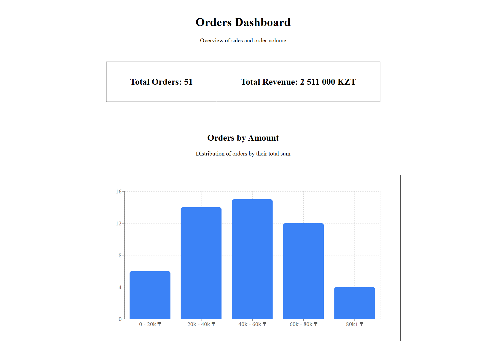
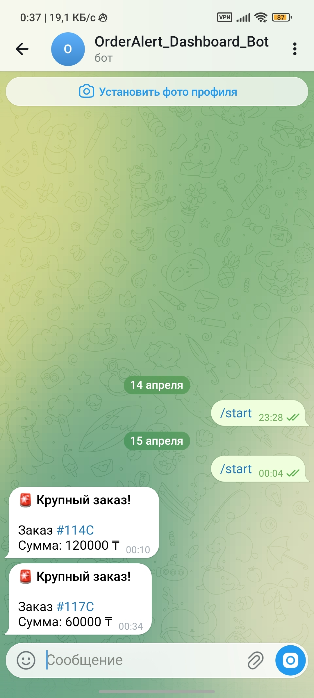

# Мини-дашборд заказов

Этот проект представляет собой мини-дашборд для визуализации заказов, интегрированный с RetailCRM и Supabase, а также отправляющий уведомления в Telegram о крупных заказах.

## Стек технологий

- **Frontend & Webhooks:** Next.js (App Router), Tailwind CSS, Recharts
- **База данных:** Supabase (PostgreSQL)
- **Интеграции:** RetailCRM API, Telegram Bot API
- **Скрипты:** Node.js, TypeScript
- **Хостинг:** Vercel

## Ссылки

- **Дашборд (Vercel):** [https://test-mini-dashboard.vercel.app](https://test-mini-dashboard.vercel.app)

## Как запустить локально

1. **Клонируйте репозиторий:**
   ```bash
   git clone https://github.com/half5life/test-mini-dashboard.git
   cd test-mini-dashboard
   ```

2. **Установите зависимости:**
   ```bash
   npm install
   ```

3. **Настройте переменные окружения:**
   Скопируйте файл `.env.example` в `.env` и заполните необходимые данные:
   ```bash
   cp .env.example .env
   ```
   *Укажите ключи для RetailCRM, Supabase и Telegram-бота.*

4. **Запуск скриптов:**
   - Импорт моковых данных в RetailCRM:
     ```bash
     npx ts-node scripts/import-to-crm.ts
     ```
   - Синхронизация заказов из RetailCRM в Supabase:
     ```bash
     npx ts-node scripts/sync-to-supabase.ts
     ```

5. **Запуск веб-сервера (Next.js):**
   ```bash
   npm run dev
   ```
   Дашборд будет доступен по адресу `http://localhost:3000`.

## Скриншоты

### Дашборд


### Пример Уведомления в Telegram


## Процесс работы с AI

Проект разрабатывался в тесном взаимодействии с AI-ассистентом Gemini CLI. В целях сохранения чистого контекста и лучшей фокусировки, работа была разбита на логические этапы, для каждого из которых создавался отдельный чат.

### Ключевые направления промптов

Работа строилась на пошаговых инструкциях и уточняющих запросах. Основные категории промптов включали:

* **Инициализация и планирование:** Запросы на анализ исходного тестового задания, выбор стека (TypeScript) и формирование подробного поэтапного плана с чек-листом для разбиения задачи на легко управляемые части (по одному чату на этап).
* **Рефакторинг и качество кода:** Указания на улучшение читаемости кода, логическое разбиение крупных функций (например, логики импорта, синхронизации и обработки вебхуков) на более мелкие.
* **Визуальные улучшения (UI/UX):** Запросы на корректировку верстки дашборда, настройку отступов, ширины контейнеров и оптимизацию использования пространства в карточках метрик.
* **Исправление ошибок (Troubleshooting):** Передача логов ошибок (например, проблем с деплоем на Vercel из-за конфигурации TailwindCSS/PostCSS) для их оперативного анализа и исправления.
* **Отладка интеграций (Вебхуки):** Совместный поиск причин неудачных запросов от RetailCRM (например, получение пустых тел запросов или HTTP 400), эксперименты с форматами передачи данных и настройка правильного JSON/Twig шаблона для триггера.

### Трудности в работе с AI и их решения

В процессе разработки возникали ситуации, когда AI ошибался, предлагал неработающие решения или упускал детали задачи. 

1. **Конфигурация TailwindCSS и PostCSS (Ошибка деплоя на Vercel)**
   * **Проблема:** AI предложил устаревшую конфигурацию TailwindCSS для Next.js, что привело к падению сборки на Vercel (`Error: It looks like you're trying to use tailwindcss directly as a PostCSS plugin`).
   * **Решение:** Проблема решилась передачей лога ошибки из Vercel напрямую в промпт. AI проанализировал трейс и корректно обновил зависимости (переход на `@tailwindcss/postcss`) и конфигурацию.

2. **Стилизация дашборда (CSS и верстка)**
   * **Проблема:** AI долго не мог корректно настроить отступы (margin/padding) внутри карточек `Total Orders` и `Total Revenue`. Текст упорно прилипал к краям ячеек, а дашборд растягивался на всю ширину широкого монитора.
   * **Решение:** Потребовалось несколько итераций. Пришлось вручную смотреть верстку через DevTools (инспектор элементов) и подсказывать AI использовать конкретные CSS-свойства (`margin`). Также AI исправил Type error библиотеки `Recharts` при типизации `Formatter`.

3. **Логика работы с данными (График Revenue over time)**
   * **Проблема:** AI успешно сверстал компонент графика для отображения выручки по времени, но не учел, что в исходном файле `mock_orders.json` отсутствуют даты заказов. В итоге график строился некорректно (одна точка).
   * **Решение:** После указания на эту логическую ошибку, функционал и данные графика были пересмотрены с учетом реальной структуры моковых данных.

4. **Настройка Webhook из RetailCRM**
   * **Проблема:** AI не смог с первого раза правильно сформировать Twig-шаблон для отправки данных заказа из RetailCRM в Next.js API. Vercel получал пустые тела запроса (HTTP 400).
   * **Решение:** Пришлось перехватывать Raw Body (`{"order": {}}`) в логах и экспериментировать с шаблонизатором RetailCRM. После передачи AI информации о том, что объект приходит пустым, совместно был выработан правильный формат payload'а.

